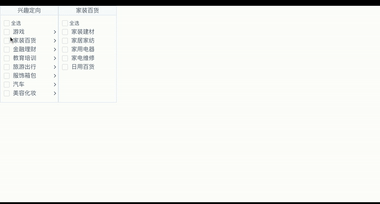

# mutil-cascader-vue

基于iview的多选框和图表的，多选层级联表，可用于城市，行业的多层级多选

Multi-cascader  based on vue, can be used for multi-selection in cities and industries


## 动态图展示：show



## 导入方法：Project setup
```
npm install mutil-cascader-vue
```

##使用：Import

```
import mutilCascaderVue from 'mutil-cascader-vue'
```

## 简单用法：usage

```
<mutiCascader
  title='兴趣定向'
  :datas='adsTagDatas'
  :defaultDatas='defaultTagDatas'
  @reciveDatas='reciveTagDatas'
  style='height: 400px;'
></mutiCascader>
```

## API

| 主要参数     | 说明                     | 类型                            |      |
| ------------ | :----------------------- | :------------------------------ | ---- |
| title        | 密码输入完成后的回调函数 | String                          |      |
| datas        | 数据来源                 | -(可以参考demo的JSON文件)       |      |
| defaultDatas | 点击忘记密码的回调函数   | -                               |      |
| reciveDatas  | 接受数据的回调函数       | 只有一个参数为选定的value的数组 |      |
